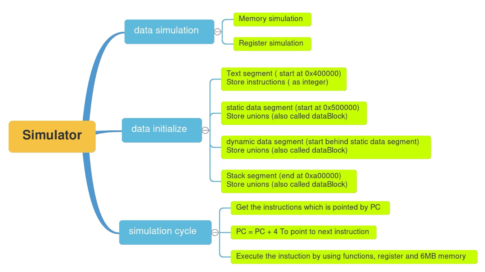

# MIPS Machine Code Simulator

## Overview
This project presents a simulator designed to emulate the execution of MIPS (Microprocessor without Interlocked Pipeline Stages) machine code. It aims to replicate the behavior of a MIPS processor, providing insights into instruction processing and execution. You can find the full project description [here](./Description.pdf).
 
## Features
- **Instruction Set**: Supports a subset of MIPS instructions, including arithmetic, logical, memory access, and control flow instructions.
- **Memory & Register Simulation**: Dynamically allocates memory for text, data, and stack segments, and registers.

- **Data Initializatio**n: Reads from .asm files to initialize data in various segments and converts instructions to binary code.
- **Simulation Cycle**: Involves fetching instructions, incrementing the program counter, and executing instructions using defined functions.
  


## Implementation Details
- Implemented in C++, utilizing malloc for memory allocation.
- Divides memory into different segments: text, data (static and dynamic), and stack.
- Defines and initializes various registers including PC, $fp$, $sp$, and $gp$.
- Uses a map to correlate register numbers with their corresponding pointers.

## Setup and Usage

```
make tester
```